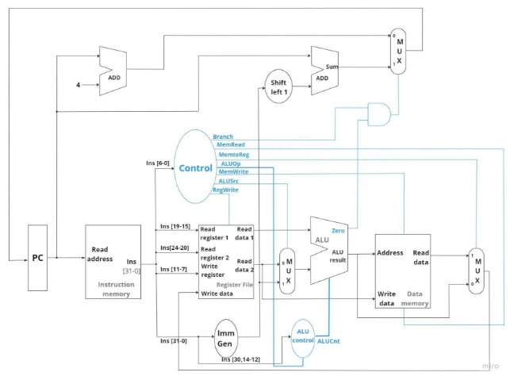
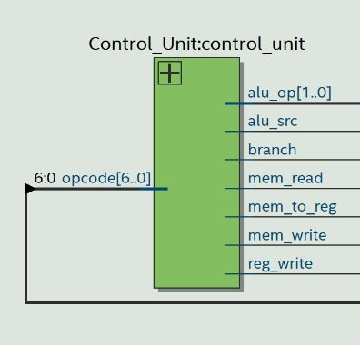
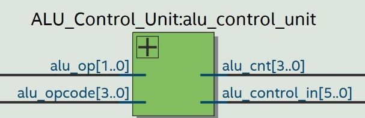
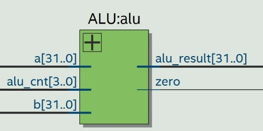
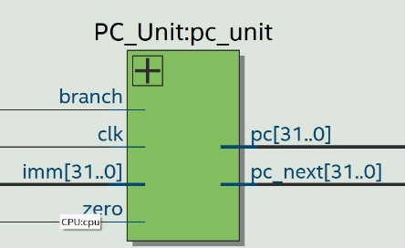
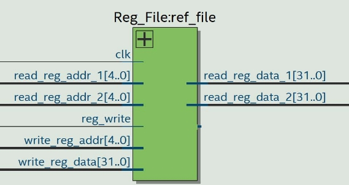
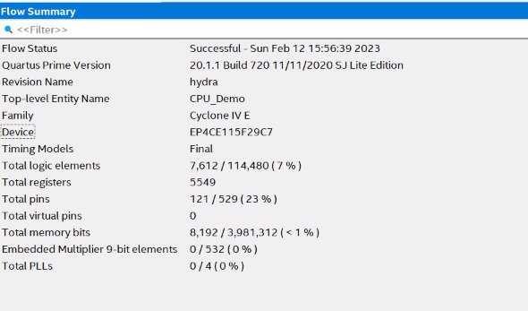
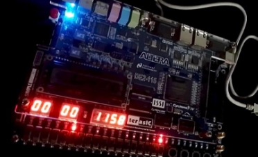

# Single Cycle RISC-V 32 bit CPU

**Introduction** 

The purpose of this project is to design and implement a single cycle RISC-V 32 bit CPU that supports the RV32I RISC-V ISA specification. The CPU design is required to include the instruction classes R-type, I-type, S-type, and SB-type, and to integrate with a direct mapping cache that includes a victim cache feature. Functionality, resource usage, and performance, with a special focus on reducing the overall delay are considered. The success of the project is verified by running suitable assembly programs on the designed CPU. This report provides an overview of the design and implementation process, as well as a archived performance. 

**Design Approach** 

- **Identify the instructions:** Identify all the instructions supported by the RISC-V ISA and categorize them into groups based on their functionality. This helps in understanding the operations that the processor needs to perform. 
- **Decode the instruction:** Once the instruction is fetched, it needs to be decoded to determine the type of operation to be performed and the operands involved. 
- **Determine the control signals:** Based on the type of operation, the control logic needs to generate the control signals to control the operations of the processor. For example, if the instruction is a load, the control logic would generate signals to read data from the memory and load it into a register. 
- **Implement the control logic:** The control logic can be implemented in a programmable logic device such as a field-programmable gate array (FPGA). Verilog is used as the hardware description language. Behavioral model is used. 
- **Test and debug:** Finally, the control logic is tested and debugged using test benches and run in simulators to ensure that it is functioning correctly. This involves testing the control logic with a variety of instructions and ensuring that it generates the correct control signals and check the output. 
- **Physical Implementation:** Upload the synthesized design to the given Altera DE2-115 FPGA board. To display the output 7 segment display is used. Inbuilt 50 MHz clock is used as the clock source. 

**Single Cycle Design** 

To be able to run the each and every instruction in a single cycle, following approach is used 

Every read operation (register/memory) implemented as combination logic (not involving the clock) 

Every write operation (register/memory) implemented as sequential logic (fired on the clock) So able to do the read and write operation in a single cycle 

**Data Path and Control Signals** 

Instruction memory outputs the instruction based on the PC value. Operands, Opcode and immediates are extracted from the instruction by slicing and connecting to the relevant path. Control unit generate control instruction for each unit based on the opcode. ALU control unit generate the control signals to perform operators based on the ALUOp from Control Unit, func3 and func7 fields of the instruction. Register File, Muxes, Data Memory activated accordingly based on the control signals form Control unit. PC increment by 4 or desired immediate based on control signals 

**Types of Instructions** 

R - Type 


|Function 7 |rs2 |rs1 |Function 3 |rd |opcode |
| - | - | - | - | - | - |

I - Type 


|Imm[11:0] |Rs1 |Function 3 |rd |Opcode |
| - | - | - | - | - |

S - Type 


|Imm[11:5] |rs2 |Rs1 |Function 3 |Imm[4:0] |opcode |
| - | - | - | - | - | - |

SB - Type 


|Imm[12,10:5] |rs2 |rs1 |Function 3 |Imm[4:1,11] |opcode |
| - | - | - | - | - | - |

**ALL possible operations** 

All the following instructions can be run in this processor. 


|**R – Type**|**I – Type** |**I - Type** |**S - type** |**SB - Type** |
| - | - | - | - | - |
|add  rd, rs1, rs2|addi  rd, rs1, imm |lb  rd, offset(rs1) |sb  rs2, offset(rs1) |beq  rs1, rs2, imm |
|sub  rd, rs1, rs2|xori  rd, rs1, imm |lh  rd, offset(rs1) |sh  rs2, offset(rs1) |bne  rs1, rs2, imm |
|xor  rd, rs1, rs2|ori  rd, rs1, imm |lw  rd, offset(rs1) |sw rs2, offset(rs1) |blt   rs1, rs2, immi |
|or  rd, rs1, rs2|andi  rd, rs1, imm |lbu  rd, offset(rs1) ||bge rs1, rs2, imm |
|and  rd, rs1, rs2|slli  rd, rs1, imm |lhu  rd, offset(rs1) ||bltu  rs1, rs2, imm |
|sll  rd, rs1, rs2|srli  rd, rs1, imm |||bgeu  rs1, rs2, imm |
|srl  rd, rs1, rs2|srai  rd, rs1, imm ||||
|sra  rd, rs1, rs2|slti  rd, rs1, imm ||||
|slt  rd, rs1, rs2|sltiu  rd, rs1, imm ||||
|sltu  rd, rs1, rs2 |||||
**Control Unit** 



There is only one input to the control unit of this processor. It is a seven bit long binary number, and it is the opcode of the given instruction. As the are five types of instructions for this processor, it is required to have five different opcodes. Here are the five opcodes. 

1. b0110011 – R type  
1. b0000011 – I type (load instructions) 
1. b0010011 – I type  
1. b0100011 – S type  
1. b1100011 – SB type  

After receiving this input, the control unit identifies the instruction type and it activates some output registers. You can see the output registers of the control unit and their bit sizes below.  

OUTPUTS of the control unit: - 

1. ALU\_OP – 2 bits controlling input to the ALU control unit 
1. alu\_src
1. mem\_to\_reg 
1. reg\_write 
1. mem\_read
1. mem\_write 
1. branch 

ex: case(opcode) 

`  `7'b0110011: // R-Type  

`        `begin 

`            `alu\_src = 1'b0; 

`            `mem\_to\_reg = 1'b0;             reg\_write = 1'b1; 

`            `mem\_read = 1'b0; 

`            `mem\_write = 1'b0;             branch = 1'b0; 

`            `alu\_op = 2'b10; 

`        `end 


||Opcode |alu\_src |mem\_to\_reg |reg\_write |mem\_read |mem\_write |branch |alu\_op |
| :- | - | - | - | - | - | - | - | - |
|R |0110011 |0 |0 |1 |0 |0 |0 |10 |
|I |0000011 |1 |1 |1 |1 |0 |0 |00 |
|I |0010011 |1 |0 |1 |0 |0 |0 |11 |
|S |0100011 |1 |x |0 |0 |1 |0 |00 |
|SB |1100011 |0 |x |0 |0 |0 |1 |01 |

Table: -Control signal values for a specific opcode 

**ALU control unit** 



There are two inputs to the ALU control unit. They are **alu\_op** and **ins[30,14:12].** With the combination of alu\_op and ins[30,14:12] we can give a command to ALU to do a defined operation.  

Ex:  See the appendix for the full code 

```I type ALU controls for immediate operations```

6'b11x000: alu\_cnt=4'b0000; //addi   
6'b11x100: alu\_cnt=4'b0010; //xori   
6'b11x110: alu\_cnt=4'b0011;//ori   
6'b11x111: alu\_cnt=4'b0100;//andi   
6'b110001: alu\_cnt=4'b0101;//slli   
6'b110101: alu\_cnt=4'b0110;//srli   
6'b111101: alu\_cnt=4'b0111;//srai   
6'b11x010: alu\_cnt=4'b1000;//slti   
6'b11x011: alu\_cnt=4'b1011;//sltiu


|Instruction Type |Operation |ALU control deciding signal |
| - | - | - |
|R |ADD |100000 |
|R |SUB |101000 |
|R |XOR |100100 |
|R |OR |100110 |
|R |AND |100111 |
|R |Shift left logical |100001 |
|R |Shift right logical |100101 |


|R |Shift right arithmetic |101101 |
| - | - | - |
|R |Set less than |100010 |
|R |Set less than unsigned |100011 |
|I |ADDI |11x000 |
|I |XORI |11x100 |
|I |ORI |11x110 |
|I |ANDI |11x111 |
|I |Shift left logical immediate |110001 |
|I |Shift right logical immediate |110101 |
|I |Shift right arithmetic immediate |111101 |
|I |Set less than immediate |11x010 |
|I |Set less than unsigned immediate |11x011 |
|I |Load byte |00xxxx |
|I |Load half |00xxxx|
|I |Load word |00xxxx|
|I |Load byte unsigned |00xxxx|
|I |Load half unsigned |00xxxx|
|S |Store byte |00xxxx|
|S |Store half |00xxxx|
|S |Store word |00xxxx|
|SB |Branch == |01x000 |
|SB |Branch != |01x001 |
|SB |Branch < |01x100 |
|SB |Branch >= |01x101 |
|SB |Branch < (U) |01x110 |

Here x means, it can be 0 or 1 

**ALU** 



There are three inputs to the ALU. Two of them are operands of the instruction. They are 32 bit long and one of them directly given by the register file while the other input comes through a MUX. Mux decides if it should give the immediate value or the register file value depending on the alu\_src control unit output signal. If it is 1 then it selects the immediate value and feed it to the ALU hence otherwise. The following table shows the ALU control signal and the corresponding operation. 

Let  “a” and “b” be the signed numbers and “A” and “B” be the unsigned numbers 


|ALU control signal |Operation |
| - | - |
|0000 |a+b |
|0001 |a-b |
|0010 |a^b |
|0011 |a|b |
|0100 |a&b |
|0101 |a<<b |
|0110 |a>>b |
|0111 |a>>>b |
|1000 |(a<b)? 32’d1:32’d0 |
|1001 |(a!=b)? 32’d0:32’d1 |
|1010 |(a<b)? 32’d0:32’d1 |
|1011 |(A<B)?32’d0:32’d1 |

` `4'b0000: alu\_result= a+b;//add 

`            `4'b0001: alu\_result= a-b;//sub 

`            `4'b0010: alu\_result= a^b;//XOR 

`            `4'b0011: alu\_result= a|b;//OR 

`            `4'b0100: alu\_result= a&b;//AND 

`            `4'b0101: alu\_result=a<<b;//shift left Logical 

`            `4'b0110: alu\_result=a>>b;//shift right logical 

`            `4'b0111: alu\_result=a>>>b;//shift right arithmatic             4'b1000: begin if (a<b) alu\_result=32'd1;else alu\_result=32'd0;end //set less than  

`            `4'b1001: begin if (a!=b) alu\_result=32'd0;else alu\_result=32'd1;end 

`            `4'b1010: begin if (a<b) alu\_result=32'd0;else alu\_result=32'd1;end 

`            `4'b1011: begin if (A<B) alu\_result=32'd1;else alu\_result=32'd0;end//set less than unsigned 

**Program Counter** 



Register, increment by 4 in each clock cycle except both zero and branch control signals are activated. If both zero and branch control signals are activated, PC increment with the desired immediate value (1 bit left shifted imm) 

**Register File** 



Implemented as array of 32 bits registers which contains 32 registers. X0 is always zero. Other registers can read and write. It has 3 of 5bit address inputs , 32bit data input, 2 of 32bit data outputs and 1bit control signal to activate write operation Read data in the regfile is implemented as combination logic. Register write done at the rising edge of the clock input. when the write signal is activated. 

**Cache Memory**

- 64 Byte Cache  
- 16 Byte Victim Cache 
- Direct Mapped Cache 

One word consists of four bytes 


One cache block consists of four data words 


In the cache there are four cache blocks like above. 

In the victim cache there is one cache blocks like above. Other registers: 

- Cache tag register – to store the tags of cache blocks 
- Victim tag register – to store the tag of victim cache blocks 
- Cache valid register – to indicate stored in the cache blocks are valid or not 
- Victim valid register – to indicate stored data in the victim cache block is valid or not 
- Temporary register – a buffer register that stores data temporarily 
- Temporary tag register – a register that stores the tag of the data block in temporary register 

Read data: 

- Check whether the required data is available in the cache. If it is available, read data from there. 
- If the required data is not available in the cache. Check whether the data is available in the victim cache. If data is available there. Load the data into a buffer register. The data available currently in the relevant cache block for expected data moved to victim cache. Then the data in the buffer is moved to the relevant cache block. 
- If the data is not available in either cache or victim cache. The expected data is loaded from the data memory to the relevant cache block. And then read the data from there. 

Write data: 

- Check whether the required data is available in the cache. If it is available, write the data into the cache and then update the relevant memory block. 
- If the required data is not available in the cache. Check whether the data is available in the victim cache. If data is available there. Swap the data in the victim cache and the relevant cache block. Write the data into the cache and then update the relevant memory block. 
- If the data is not available in either cache or victim cache. The expected data is loaded from the data memory to the relevant cache block. Write the data into the cache and then update the relevant memory block. 


||**Resource Usage** |
| :- | - |
|||
|||


**Achieved performance level**


Practically archived Fmax = 50MHz 

(We used DE2-115 which has max 50MHz clock source)

**Demonstration** 

Following sample code was used which covers all the supported instruction types. Then all the instruction were converted to machine code and loaded it to the instruction memory. Value of x3 is displayed on the 7-segment display. So x3 value is the result. 

addi x1,x0,5        # I 

addi x2,x0,12       # I 

add x3, x1, x2      # R         result = h11 (hexadecimal 11) 

addi x2, x0, -9     # I 

sub x3, x3, x2      # R         result = h1A 

xor x3, x3, x1      # R         result = h1F 

addi x4, x0, 10     # I  

or x1, x1, x4       # R         result(stored in x1) = hF 

and x3, x3, x1      # R         result = hF 

addi x5, x0, 1      # I  

sll x3, x3,x5       # R         result = h1E 

srl x4, x4, x       # R         result(stored in x4) = h5 

xori x4, x4, 24     # I         result(stored in x4) = h1D 

sw x4, 77(x1)       # S         result = h1D is stored in memory address 92 lw x3, 77(x1)       # I(load)   result = h1D 

addi x6, x0, 29     # I  

beq x3, x6, 8       # SB 

addi x3, x4, 35     # I         result = h40 if x3!=x6 

addi x3, x4, 40     # I         result = h45 if x3==x6  

slli x3, x3, 10     # I         result = h11400 

srli x3, x3, 3      # I         result = h2280 

srai x3, x3, 1      # I         result = h1140 

blt x6, x3, 8       # SB  

addi x3, x3, 29     # I 

addi x3, x3, 24     # I         result = h1158 (Final Result) beq x0,x0,0       # SB       Infinite loop 

[Videos of the running demonstration (intentionally reduced the clock speed by dividing clock source to view the result step by step) ](https://dms.uom.lk/s/aoxn4iG7xy5rTTW)
